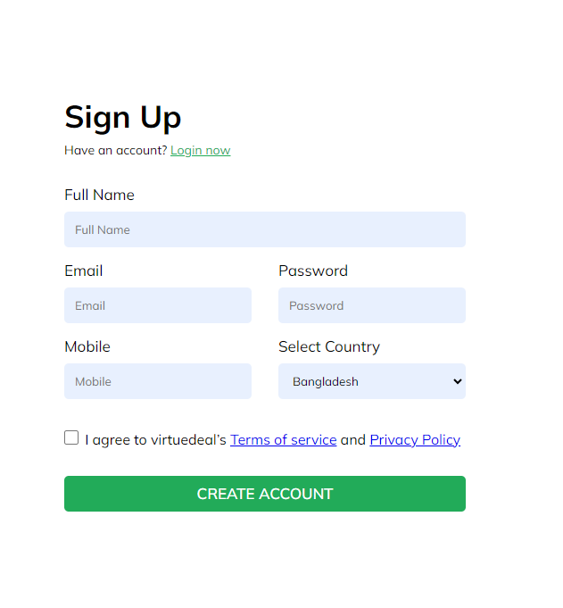
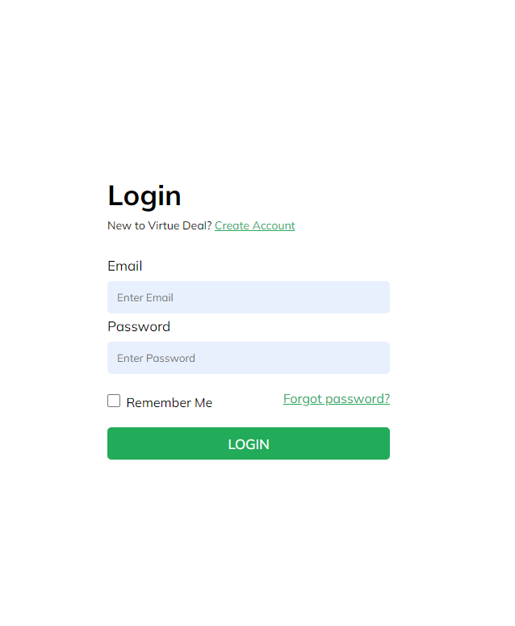
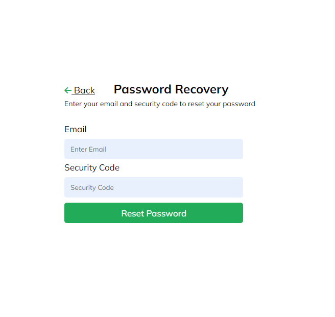

# login_register_forget_password_template

  
  
  

> This is a simple login, register, and forget password page created using HTML and CSS.
> 
## Features
- User-friendly login and registration forms.
- Responsive design for mobile and desktop.

## Demo

See Demo : <a href="https://ziauddin128.github.io/login_register_forget_password_template/register.html">Demo</a>
